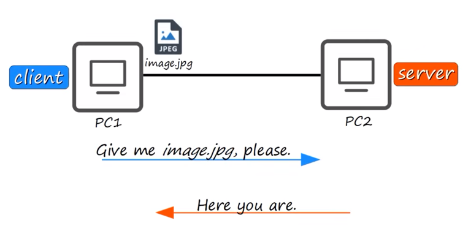
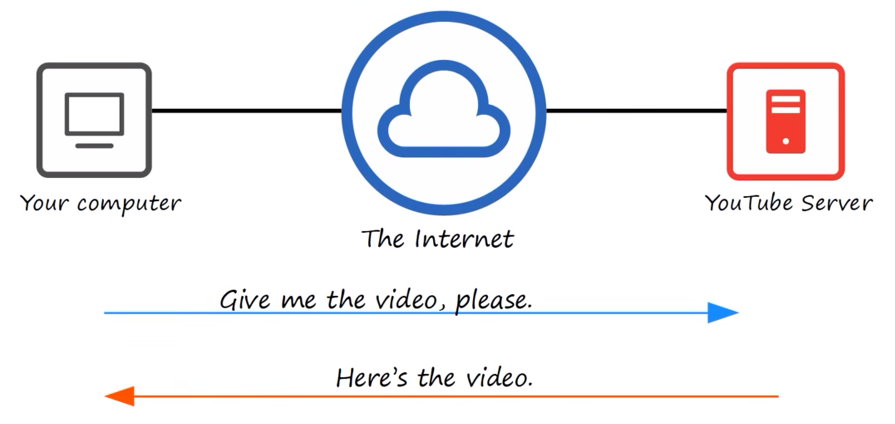
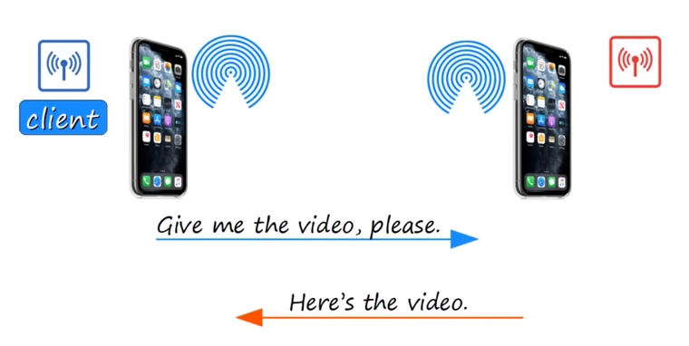
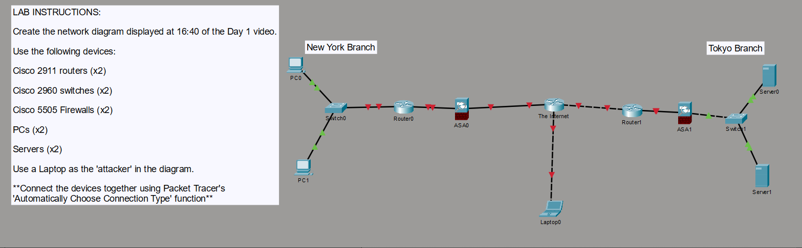

# Network Devices - Introductory Lesson Notes

## Summary
This note lesson serves as the foundation for the entire CCNA (Cisco Certified Network Associate) 200-301 course. The course is completely free and covers everything on the official Cisco exam topics list, though it is also includes extra context to help build general networking intuition. You do need any prior background in networking, IT, or programming to get started; the only requirement is a basic familiarity with computers.

To study effectively, Jeremy recommends using three primary resources alongside the lectures:
- **End-of-video quizzes** to practice Cisco-style exam questions.
- **Packet Tracer practice labs** to get hands-on experience with Cisco's network simulation software.
- **Anki flashcards** to help memorize technical details. For efficiency, Jeremy suggests creating one central "CCNA" deck and transferring new cards into it, rather than keeping dozens of separate mini-decks.
---
## Key Concepts
### What is a [[Network]]?
Academic definition can sometimes feel overly complicated. For example, Wikipedia defines a computer network as a digital telecommunications network that allows nodes to share resources.

To make this easier to understand, Jeremy explains that *a network is simply two or more devices connected so they can share resources and have a conversation with each other.*
- **The Simplest Network**: If you connected just two PCs together using a single physical cable, you have officially created a network.
- **End Hosts (Endpoints)**: These are the devices at the edge of the network that actually generate or consume data. Clients and servers both fall under this umbrella term.
### Clients and Servers
In any network transaction, end hosts act as either a client or a server. These roles depend entirely on who is asking for data and who is providing it.
- **Client**: *A device that requests and accesses a service or file.* Examples include a Windows desktop PC, macOS iMac, or an Apple iPhone. [[Client]]
- **Server**: *A device that provides function, files, or services to clients.* While we often picture powerful Dell or IBM hardware stacked in massive data centers, any standard client device can also act as a server. [[Server]]
- **Dynamic Roles:** The same physical device can change roles depending on the situation
#### Three Key Examples of Client-Server Dynamics
1. **Direct Cable File Share**: If PC1 is connected to PC2 and requests a file called `image.jpg`, PC1 acts as the client because it is asking for the file. PC2 acts as the server because it is fulfilling that request and sending the image.    

 
 <small> Source: Jeremy's IT Lab <a href="https://youtu.be/H8W9oMNSuwo?si=a8oadj1_WOtS9ios"># Free CCNA | Network Devices | Day 1 | CCNA 200-301 Complete Course</a></small>
 
2. **Streaming Web Video**: When you stream a video, your device acts as the client by requesting the page and video from YouTube. YouTube acts as the server by streaming the data back to you over the Internet. In network diagrams, the Internet is represented as a blue cloud to hide all the complex routing details that are not necessary for the diagram. 
   

 
 <small> Source: Jeremy's IT Lab <a href="https://youtu.be/H8W9oMNSuwo?si=a8oadj1_WOtS9ios"># Free CCNA | Network Devices | Day 1 | CCNA 200-301 Complete Course</a></small>
 
3. **Mobile AirDrop**: When you receive a video from your frined's iPhone via AirDrop, your phone acts as the client (requesting the file) while your friend's phone acts as the server (sending the file)
   

 
 <small> Source: Jeremy's IT Lab <a href="https://youtu.be/H8W9oMNSuwo?si=a8oadj1_WOtS9ios"># Free CCNA | Network Devices | Day 1 | CCNA 200-301 Complete Course</a></small>
 
---
### Core Network Devices
1. **Switches** [[Switch]]
	- **Primary Purpose:** A switch is used to connect and aggregate multiple end hosts (like PCs, and network printers) within the same local area.
	- **How They Work:** They provide connectivity to devices residing in the same LAN (Local Area Network). A LAN refers to a localized area, such as a single office floor, a small home network, or an entire small office.
	- **Physical Characteristics:** Switches are easily recognizable because they have a high density of physical ports, typically featuring 5, 8, 16, 24, or more connections.
	- **Key Limitations:** Switches cannot connect directly to the Internet, nor can they send data between entirely separate LANs.
	- **Example Models**: *Cisco Catalyst 9200 and Catalyst 3650* (Cisco's standard enterprise-grade switches)
2. **Routers** [[Router]]
	- **Primary Purpose:** Routers do the opposite of switches by connecting entirely separate LANs together and forwarding data across the Internet.
	- **Physical Characteristics:** Routers have relatively few physical ports compared to switches.
	- **How They Work:** If PC1 in a New York office wants to communicate with Server 1 in a Tokyo office, the local switch cannot help it reach Tokyo. Instead, the switch forwards the traffic to the local router, which has the intelligence to direct the data across the Internet toward the destination.
	- **Example Models:** Cisco ISR (Integrated Services Router) 900, 1000, and 4000 series
3. **Firewalls** [[Firewall]]
	- **Primary Purpose:** A firewall is a dedicated security device designed to protect your network by monitoring and controlling traffic entering and exiting the network based on strict security rules.
	- **Why They Are Vital:** Routers only provide very basic security features. Because of the constant threat of attackers on the Internet trying to steal information or damage corporate assets, networks require dedicated firewalls to drop unauthorized traffic while letting safe business data pass through.
	- **Placement:** Firewalls are highly flexible. They can be placed "outside" the router (facing the raw Internet) or "inside" the network (facing your local devices), and sometimes networks use both placements.
	- **Network vs. Host-Based:**
	    - _Network Firewall:_ A dedicated hardware appliance that filters traffic moving between entire networks (this is the primary focus of this CCNA course).
	    - _Host-Based Firewall:_ A software program installed directly on a single computer (like Windows Defender) to serve as a localized, extra line of defense.
	- **Next-Generation Firewalls (NGFW):** These are modern firewalls that combine traditional traffic filtering with advanced security systems, such as an IPS (Intrusion Prevention System) to stop active threats.
	- **Example Models:** Cisco ASA 5500-X (Cisco's classic firewall platform that now supports modern NGFW features) and the Cisco Firepower 2100 series.

### Device Summary Table

| Device Type | Main Role                                     | Port Density    | Scope of Connectivity                     |
| ----------- | --------------------------------------------- | --------------- | ----------------------------------------- |
| Switch      | Connects end hosts together locally.          | High (24+)      | Inside a single LAN.                      |
| Router      | Connect different networks and forwards data. | Low (few ports) | Between different LANs and the Internet   |
| Firewall    | Filter inbound and outbound traffic.          | Varies          | Across security boundaries and perimeters |

---
### Step-by-Step Data Flow Example (Branch-to-Branch)

 
 <small> Source: Jeremy's IT Lab <a href="https://youtu.be/a1Im6GYaSno?si=ZeRnPo2XZ7Av4QGh">Free CCNA | Packet Tracer Introduction | Day 1 Lab | CCNA 200-301 Complete Course </a></small>
 
To visualize how these devices operate together, consider an enterprise network with two locations: a New York Branch and a Tokyo Branch.

When PC1 in New York requests a file from Server 1 in Tokyo, the data takes this exact hop-by-hop journey:

1. **PC1 (New York Client)** sends the initial file request to its local switch, **SW1**.
2. **SW1** forwards the request to the New York branch router, **R1**.
3. **R1** forwards the data through the local firewalls and across the **Internet** (the cloud).
4. The request arrives at the Tokyo branch router, **R2**.
5. **R2** forwards the data to the Tokyo local switch, **SW2**.
6. **SW2** delivers the request directly to **Server 1 (Tokyo Server)**.

_Note: Once Server 1 processes the request, it sends the response back to PC1 by following this exact same physical path in reverse_.
## References
- Jeremy's IT Lab: [# Free CCNA | Network Devices | Day 1 | CCNA 200-301 Complete Course](https://youtu.be/H8W9oMNSuwo?si=a8oadj1_WOtS9ios)