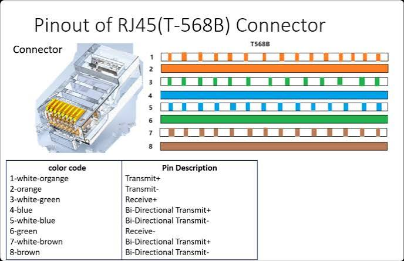
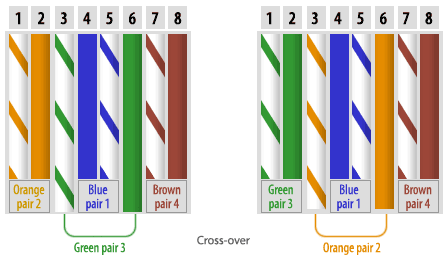
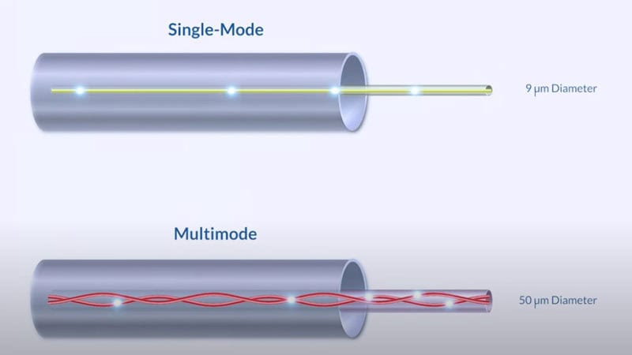

## Summary
This is the second lesson of the CCNA Course, focusing on the physical elements that connect network devices, specifically interfaces and cables. It defines why network standards are necessary for physical and logical communication and explains the differences between bits and bytes in network speeds. The lesson than compares copper cabling, including unshielded twisted pair cables, and fiber-optic cabling, detailing their speeds, physical structures, pin configurations, and maximum transmission distances. 

---
## Key Concepts
### Why Network Standards Matter
Before looking at physical cables, it is important to understand why we have protocols (set of rules that govern how devices communicate) and standards.

If two people speak completely different languages, they cannot communicate without an agreed upon system. Similarly, network devices need a common language. Standards ensure that hardware from entirely different manufacturers will have matching physical connectors and use the same logical communication rules. 

---
### Understanding Network Speeds (Bits vs Bytes)
Computers work using binary code, which is a series of 0s and 1s. When data travels over a copper cable, variations in the electrical signal are interpreted by the receiving device as these 0s and 1s.
- **Bit:** The smallest unit of data, represented by a single 0 or 1.
- **Byte:** A group of 8 bits.
- **The Crucial Difference:** Network transmission speed is always measure in **bytes.** Because a byte is 8 times larger than a bit, a Gigabyte of storage is actually eight times larger than a gigabit of network speed.

Jeremy outlines the common speed measurements as follows:
- **1 Kilobit (Kb):** 1.000 bits
- **1 Megabit (Mb):** 1.000.000 bits (1 million bits)
- **1 Gigabit (Gb):** 1.000.000.000 bits (1 billion bits)
- **1 Terabit (Tb):** 1.000.000.000.000 bits (1 trillion bits)
---
### Copper Ethernet Cabling
Wired networks typically connect PCs and switched using copper Ethernet cables with **RJ-45 (Registered Jack 45)** connectors, which plug into matching RJ-45 ports.

These are known as **UTP (Unshielded Twisted Pair)** cables. They are called unshielded because they lack a metallic wrapper to protect them from external electrical noise. To compensate for this, the eight internal wires are grouped into four pairs and twisted together. This twisting technique naturally helps protect the data from **EMI (Electromagnetic Interference)**, which is electrical disruption form outside sources like power lines or lights.
#### How Wires Transmit Data (Pinouts)

  
An RJ-45 port has 8 physical pins. However, different Ethernet speed standards utilize these pins differently:
 - **10BASE-T (Standard Ethernet, 10Mbps) and 100BASE-T (Fast Ethernet, 100Mbps):** These standards only use 2 pairs (4 wires in total).
	 - **PCs and Routers** transmit data (Tx) on pins 1 and 2, and they receive data (Rx) on pins 3 and 6.
	 - **Switches:** do the opposite; they receive data (Rx) on pins 1 and 2, and transmit data (Tx) on pins 3 and 6.
	 - Because they use separate wires to send and receive, they can achieve **full-duplex transmission**. This means both devices can send and receive data at the exact same time without causing data collisions.
- **1000BASE-T (Gigabit Ethernet) and 10GBASE-T (10 Gigabit Ethernet):** These faster standards use all 4 pairs, which means they use all 8 wires. 
	- The physical pairings for the wires are Pair 1 (pins 1 and 2), Pair 2 (pins 3 and 6), Pair 3 (pins 4 and 5), and Pair 4 (pins 7 and 8).
	- Instead of dedicating separate pairs for transmitting and receiving, **each of the four pairs is bidirectional**. This means that every single pair transmits and receives data simultaneously over the exact same wires, which is a major reason why there standards can achieve such high speeds.
- **Distance Limit:** All copper twisted-pair cables have a maximum physical length limit of 100 meters for performance and techincal reasons. 
#### Straight-Through vs Crossover Cables
Because different devices use different pins to send and receive, we must use the correct type of cable. 
- **Straight-Through Cable:** Pin 1 connects to pin 1, pin 2 connects to pin 2, and so on. This is used when connecting **different types of devices** (like a PC to a switch, or a router to a switch) because their internal pin configurations naturally line up to allow transmission and reception.
  

  
- **Crossover Cable:** The transmitting and receiving pairs are reversed on one end of the cable. (pin 1 connects to pin 3, pin 2 connects to pin 6). This is required when connecting **identical types of devices** (like PC to PC, router to router, switch to switch) so that one device's transmit pins map directly to the other's receive pins.
    

  
- **Auto MDI-X:** This is a modern features that allows network ports to automatically detect which wires the neighboring device is transmitting on and adjust their own pins to match. Thanks to Auto MDI-X, you do not have to worry about choosing between straight-through and crossover cables unless you are working with very old equipment.
---
### Fiber-Optic Cabling
While copper cables are great for local connections, they cannot go past 100 meters. For longer distances, or to connect high-performance routers and switches, we use **fiber-optic cables**. These plug into specialized ports using an **SFP (Small Form-factor Pluggable)** transceiver, which is a hot-swappable metal module that converts electrical signals into light.

Instead of electrical signals, fiber cables transmit pulses of light down a **fiberglass core**. The cable consists of four main layers: the glass core, the **cladding** (a reflective layer that keeps the light bouncing down the core), a protective buffer, and an outer jacket.

There are two main types of fiber-optic cabling:
1. **Multimode Fiber (MMF):** This cable has a wider glass core, allowing multiple angles (known as modes) of light-waves to travel down it at once. It uses cheaper, LED-based transmitters. While it supports distances much longer than 100 meters, it is still shorter and cheaper than single-mode fiber.
2. **Single-mode Fiber (SMF):** This cable has an extremely narrow glass core, forcing light to travel straight down the center in a single mode. It requires highly precise, expensive laser-based transmitters. It is more costly, but it supports incredibly long distances.
  

  

---
### Ethernet Cabling Standards Comparison

|Standard Name|Common Name|Cable Type|Max Distance|Official IEEE Standard|
|---|---|---|---|---|
|**10BASE-T**|Ethernet|Copper UTP|100 meters|802.3|
|**100BASE-T**|Fast Ethernet|Copper UTP|100 meters|802.3|
|**1000BASE-T**|Gigabit Ethernet|Copper UTP|100 meters|802.3|
|**10GBASE-T**|10 Gigabit Ethernet|Copper UTP|100 meters|802.3|
|**1000BASE-LX**|Gigabit Fiber|Multimode / Single-mode|550m (MMF) / 5km (SMF)|802.3z|
|**10GBASE-SR**|10G Fiber (Short Reach)|Multimode|400 meters|802.3ae|
|**10GBASE-LR**|10G Fiber (Long Reach)|Single-mode|10 kilometers|802.3ae|
|**10GBASE-ER**|10G Fiber (Extended Reach)|Single-mode|30 kilometers|802.3ae|

---
### Study Chart: Copper (UTP) vs Fiber-Optic Cabling
|Feature / Characteristic|Copper (UTP) Cables|Fiber-Optic Cables|
|---|---|---|
|**Physical Medium**|Transmits electrical signals over eight thin copper wires.|Transmits light pulses over glass fibers.|
|**Physical Connectors**|Uses RJ-45 plastic connectors.|Uses SFP (Small Form-factor Pluggable) transceiver modules.|
|**Maximum Distance**|Hard limit of 100 meters for all standards.|Supports ranges from 400 meters to 30 kilometers.|
|**Interference Resistance**|Vulnerable to EMI (Electromagnetic Interference), though twisting the wires helps.|Completely immune to electromagnetic interference.|
|**Relative Cost**|Very inexpensive for both the cable and the equipment ports.|More expensive, especially for laser-based single-mode gear.|
|**Security Profile**|Emits a faint signal outside the cable which could theoretically be intercepted.|Emits absolutely no signal outside the cable, making it highly secure.|

---
## References
- Jeremy's IT Lab: [Interfaces and Cables](https://youtu.be/ieTH5lVhNaY)