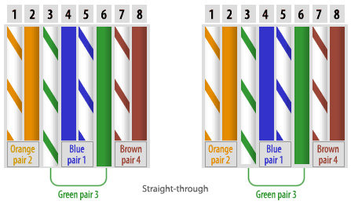

# Interfaces and Cables

## Summary
This lesson covers how network devices are physically connected via cables, focusing on Ethernet standards defined under **IEEE 802.3**. It explains the basics of bits and bytes, the RJ-45 connector and UTP copper cabling, the different Ethernet speed standards (10BASE-T through 10GBASE-T), how transmit/receive pin assignments differ between device types, the difference between straight-through and crossover cables, the Auto MDI-X feature, and an introduction to fiber-optic connections (multimode vs single-mode) as a faster, longer-distance alternative to copper.

## Key Concepts

### Bits, Bytes, and Speed
- A **bit** is a single binary value (0 or 1) and a **byte** equals 8 bits.
- Network speed is measured in **bits per second** (e.g., Mbps, Gbps), not bytes per second. Note that 1 gigabyte is 8 times larger than 1 gigabit.
- Units scale by factors of 1,000, going from kilobit to megabit to gigabit to terabit.

### Ethernet and Cabling Basics
- **Ethernet** is a collection of protocols and standards, not a single protocol, and it's defined under **IEEE 802.3**.
- **RJ-45** is an 8-pin connector used on the end of copper Ethernet cables.
- **UTP (Unshielded Twisted Pair)** is copper cabling with 4 twisted wire pairs (8 wires total). The twisting reduces **electromagnetic interference (EMI)**, which is external electrical noise (from power lines, motors, other devices) that can corrupt signals traveling through copper wire. *Baseband signalling* (the "base" in cable names) means the entire cable capacity carries a single data signal at a time, unlike broadband which can carry multiple channels at once.

### Copper Ethernet Standards (IEEE 802.3)

| Speed | Common name | IEEE standard | Max length | Wire pairs used |
|---|---|---|---|---|
| 10 Mbps | 10BASE-T (Ethernet) | IEEE 802.3 | 100 m | 2 pairs (4 wires) |
| 100 Mbps | 100BASE-T (Fast Ethernet) | IEEE 802.3u | 100 m | 2 pairs (4 wires) |
| 1 Gbps | 1000BASE-T (Gigabit Ethernet) | IEEE 802.3ab | 100 m | 4 pairs (8 wires) |
| 10 Gbps | 10GBASE-T (10-Gigabit Ethernet) | IEEE 802.3an | 100 m | 4 pairs (8 wires) |

10BASE-T and 100BASE-T use only 2 of the 4 available wire pairs. 1000BASE-T and 10GBASE-T use all 4 pairs, since each pair becomes bidirectional, which allows much higher throughput.

### Tx/Rx Pin Assignments (10BASE-T / 100BASE-T)

| Device | Transmit (Tx) | Receive (Rx) |
|---|---|---|
| PC | Pins 1 & 2 | Pins 3 & 6 |
| Router | Pins 1 & 2 | Pins 3 & 6 |
| Firewall | Pins 1 & 2 | Pins 3 & 6 |
| Switch | Pins 3 & 6 | Pins 1 & 2 |

**Full-duplex** transmission allows both devices to send data at the same time without collisions, since transmit and receive happen on separate wire pairs. It works a bit like a phone call, where both people can talk and listen at once, as opposed to *half-duplex* (like a walkie-talkie), where only one side can transmit at a time. Switches are the exception here, since their Tx/Rx pin assignment is the reverse of PCs, routers, and firewalls.

### Copper Cable Types
- **Straight-through cable**: pin 1 connects to pin 1, pin 2 to pin 2, and so on. Used when connecting devices with opposite Tx/Rx assignments, such as PC to switch or router to switch.  

- **Crossover cable**: transmit pins on one end connect to receive pins on the other end (1 to 3, 2 to 6). Used when connecting devices with the same Tx/Rx assignments, such as PC to PC, router to router, switch to switch, or PC to router. 

- **Auto MDI-X**: a feature on modern network devices that automatically detects which pins the connected device uses to transmit, then adjusts its own Tx/Rx pins to match. This removes the need to manually pick between straight-through and crossover cables.

### Fiber-Optic Connections
Fiber-optic cabling uses a **glass core** to transmit data as light instead of electrical signals, which makes it immune to EMI and capable of much longer distances than copper. Fiber cables have **separate strands for transmit and receive**, and they connect to switches or routers through an **SFP transceiver (Small Form-Factor Pluggable)**, a small pluggable module that converts electrical signals to optical signals and back.

### Fiber-Optic Cable Types
There are two fiber types, distinguished by **mode** (the path or angle at which light enters the fiber core): 
- **Multimode fiber (MMF)** has a wider core that allows multiple light angles (modes) to enter. It covers shorter maximum distances and is cheaper, since it uses LED-based transmitters.
- **Single-mode fiber (SMF)** has a narrower core where light enters at a single angle through a laser-based transmitter. It allows much longer distances but costs more.

**Fiber-optic standards:**

| Speed | Standard | Mode | Max distance | IEEE standard |
|---|---|---|---|---|
| 1 Gbps | 1000BASE-SX | Multimode | 220 to 550 m | IEEE 802.3z |
| 1 Gbps | 1000BASE-LX | Single-mode (multimode also supported) | 5 to 10 km | IEEE 802.3z |
| 10 Gbps | 10GBASE-SR | Multimode | around 300 to 400 m | IEEE 802.3ae |
| 10 Gbps | 10GBASE-LR | Single-mode | 10 km | IEEE 802.3ae |
| 10 Gbps | 10GBASE-ER | Single-mode | 30 to 40 km | IEEE 802.3ae |

### UTP vs Fiber-Optic

| Aspect | UTP | Fiber-optic |
|---|---|---|
| Transmission medium | Electrical signal (copper) | Light (glass core) |
| Vulnerable to EMI | Yes | No |
| Max distance | 100 m | Hundreds of meters to tens of km |
| Cost | Cheaper | More expensive, especially single-mode |
| Typical use | Short-distance connections within a LAN | Backbone links, long-distance or inter-building connections |

## Personal Notes
Key things to remember for the exam: which wire pairs each device transmits/receives on (UTP), the IEEE standard number for each cable type, and the cable specs (speed, mode, max distance). It's worth noting that copper and fiber standards use different IEEE suffixes: 802.3u, 802.3ab, and 802.3an for copper, versus 802.3z and 802.3ae for fiber.

## References
- Jeremy's IT Lab: [Interfaces and Cables](https://youtu.be/ieTH5lVhNaY)