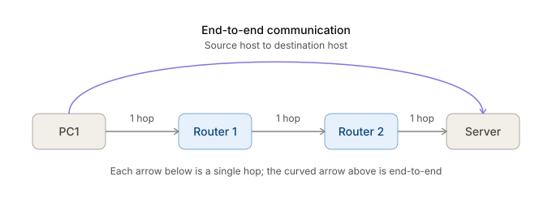
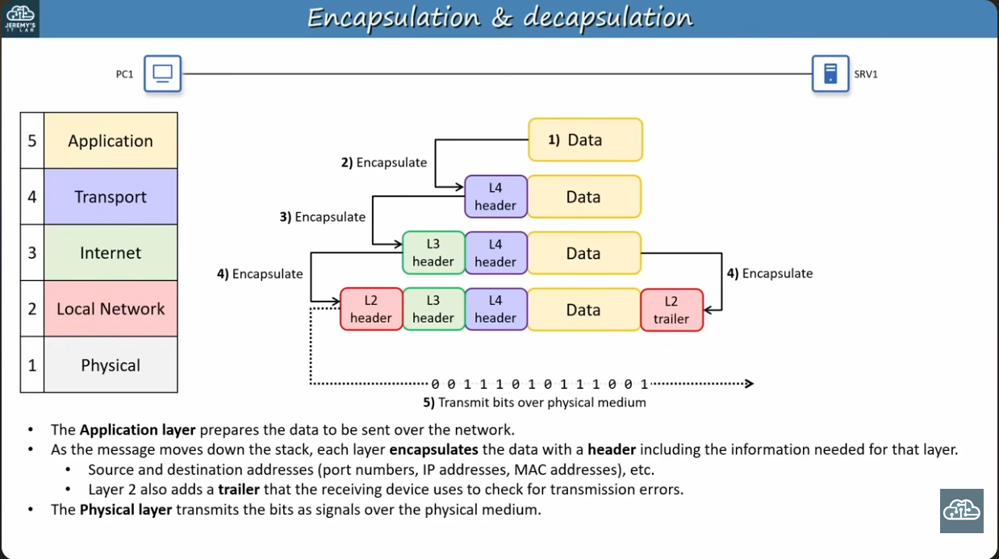
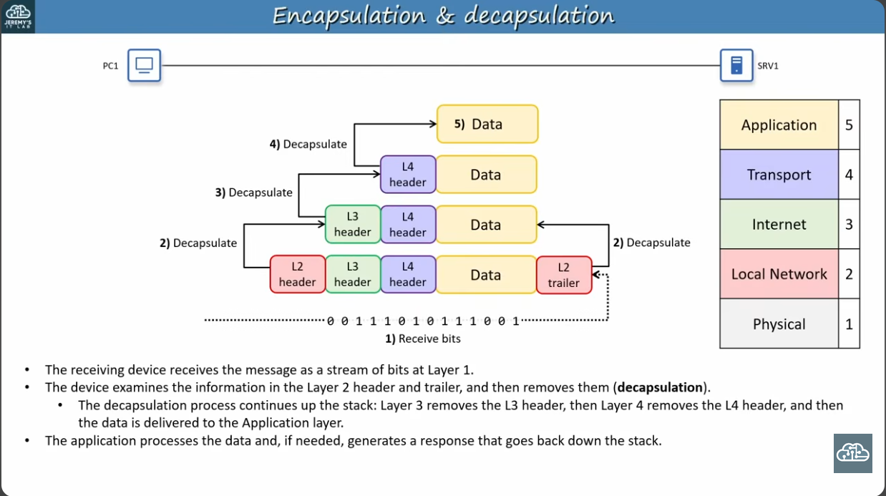
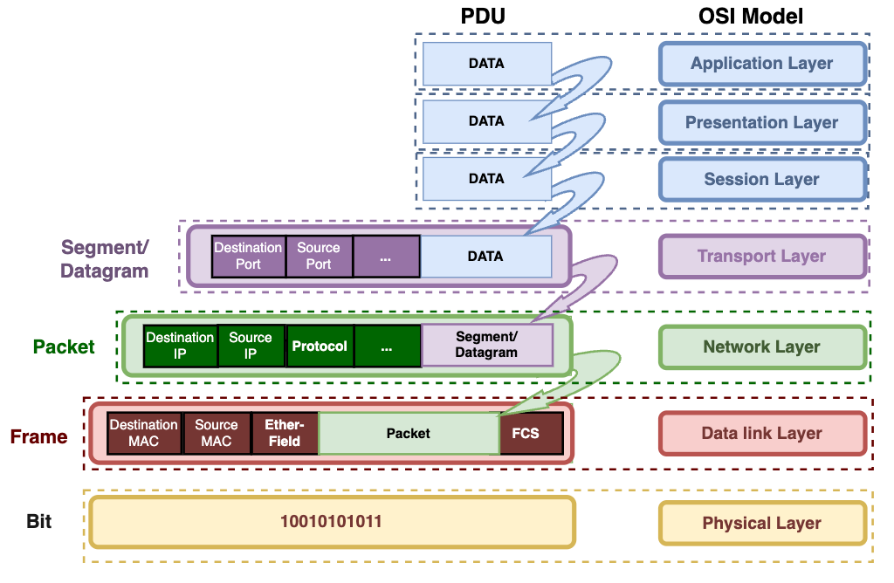

# TCP/IP Model & Internet Protocol Suite

## Summary
The Internet Protocol Suite (TCP/IP) is the collection of protocols that enables communication over the Internet and modern computer networks. Instead of treating networking as one large process, TCP/IP divides communication into layers, where each layer has a specific responsibility and provides services to the layer above it.

The layered approach makes networks modular, scalable, and interoperable. Devices from different vendors can communicate because they implement the same open standards defined by organizations such as the IEEE and IETF.

The five-layer TCP/IP model consists of:

1. **Application Layer**, communication between applications (HTTP, HTTPS, DNS, FTP, etc.)
2. **Transport Layer**, end-to-end communication between processes using TCP/UDP and port numbers.
3. **Internet Layer**, end-to-end communication between hosts using IP addresses and routers.
4. **Local Network Layer**, hop-to-hop delivery within a LAN using Ethernet/Wi-Fi, MAC addresses, and switches.
5. **Physical Layer**, transmits bits as electrical, optical, or radio signals.

Communication follows **encapsulation**, where each lower layer adds its own header (and Layer 2 also adds a trailer), and **decapsulation**, where the receiving host removes each layer's information in reverse order.

The TCP/IP model is a conceptual framework rather than a strict rule. Different references may use 4-layer, 5-layer, or 7-layer models, with the OSI model remaining popular as a teaching tool despite TCP/IP being the protocol suite used in real-world networks.

---

## Key Concepts

### Protocols & Standards
- **Protocol**: rules that define how devices communicate.
- **Standard**: agreed specification describing how a protocol or technology should work.
- Open standards allow interoperability between devices from different vendors.

### History
- ARPANET (1969) originally used **NCP (Network Control Program)**.
- TCP was developed by **Vint Cerf** and **Bob Kahn** in 1974.
- TCP later split into:
  - TCP (Transmission Control Protocol)
  - IP (Internet Protocol)
- ARPANET officially adopted TCP/IP on **January 1, 1983**.

### Standards Organizations
- **IEEE**
  - Ethernet (IEEE 802.3)
  - Wi-Fi (IEEE 802.11)
  - Defines physical transmission and local network technologies.
- **IETF**
  - Defines Internet protocols.
  - Publishes standards as **RFC (Request for Comments)** documents.
  - Examples:
    - IP
    - TCP
    - UDP
    - HTTP
    - DNS

---

### TCP/IP Five-Layer Model

| Layer | Name |
|---|---|
| 5 | Application |
| 4 | Transport |
| 3 | Internet |
| 2 | Local Network |
| 1 | Physical |

#### 5. Application Layer
**Purpose**
- Communication between application processes.
- Defines message formats and application-specific protocols.

**Examples**
- HTTP / HTTPS
- FTP
- TFTP
- DNS
- Email protocols

**Key Idea**
- Applications communicate using standardized protocols.

---

#### 4. Transport Layer
**Purpose**
- End-to-end communication between application processes.
- Identifies applications using **port numbers**.

**Protocols**
- TCP
- UDP

**Examples**
- HTTP uses Port 80
- FTP uses Port 21

**Key Idea**
- Process-to-process communication.

---

#### 3. Internet Layer
**Purpose**
- End-to-end communication between hosts.
- Uses IP addresses.
- Routers operate primarily at this layer.

**Protocols**
- IPv4
- IPv6
- ICMP

**Key Idea**
- Host-to-host communication.

---

#### 2. Local Network Layer
**Purpose**
- Hop-to-hop delivery within a LAN.

**Uses**
- MAC addresses
- Switches

**Protocols**
- Ethernet
- Wi-Fi

**Key Idea**
- Delivers data to the next device on the local network.

---

#### 1. Physical Layer
**Purpose**
- Transmits raw bits over physical media.

**Media**
- Copper (UTP)
- Fiber optic
- Wireless radio

**Defines**
- Cables
- Connectors
- Signal types
- Link speeds

---

### Layer Responsibilities

| Layer | Responsible For | Uses |
|--------|-----------------|------|
| Application | Application communication | HTTP, DNS, FTP |
| Transport | Process-to-process communication | TCP, UDP, Ports |
| Internet | Host-to-host communication | IP, Routers |
| Local Network | Hop-to-hop communication | Ethernet, Wi-Fi, MAC |
| Physical | Signal transmission | Cables, Fiber, Radio |

---

### Hop vs End-to-End

**Hop**
- One step between devices.
- Example:
  - PC to Router is 1 hop
  - Router to Router is 1 hop
  - Router to Server is 1 hop

**End-to-End**
- Communication from the source host to the final destination host.

---

### Encapsulation

When sending data, each layer wraps the data with information needed for its own function, in this order:

1. Application Data
2. Transport Header
3. Internet Header
4. Local Network Header + Trailer
5. Physical Signals

### Decapsulation

The receiving host reverses the process:

1. Signals
2. Remove Layer 2 Header & Trailer
3. Remove Layer 3 Header
4. Remove Layer 4 Header
5. Application receives data

### Protocol Data Units (PDUs)

| Layer | PDU Name |
|--------|----------|
| Application | Data |
| Transport (TCP) | Segment |
| Transport (UDP) | Datagram |
| Internet | Packet |
| Local Network | Frame |
| Physical | Bits |

---

### Payload

The **payload** is everything inside a protocol's header.

Examples:
- Layer 4 payload is the application data
- Layer 3 payload is the transport segment/datagram
- Layer 2 payload is the IP packet

---

### Layer Interaction

#### Adjacent-Layer Interaction
Each layer:
- Uses services from the layer below.
- Provides services to the layer above.

Example:
- Layer 3 relies on Layer 2.
- Layer 4 relies on Layer 3.

---

#### Same-Layer Interaction
Equivalent layers communicate logically.

Examples:
- HTTP to HTTP
- TCP to TCP
- IP to IP
- Ethernet to Ethernet

---

### Benefits of Layering

- Separation of responsibilities
- Easier troubleshooting
- Vendor interoperability
- Modular protocol replacement
- Scalability
- Easier protocol development

Example:
- HTTP can be replaced with FTP without changing IP or Ethernet.
- Ethernet can be replaced with Wi-Fi without affecting TCP or HTTP.

---

### TCP/IP vs OSI Model

| TCP/IP (5 Layer) | OSI (7 Layer) |
|------------------|---------------|
| Application | Application |
| Application | Presentation |
| Application | Session |
| Transport | Transport |
| Internet | Network |
| Local Network | Data Link |
| Physical | Physical |

Notes:
- TCP/IP is the protocol suite used in real networks.
- OSI is mainly a conceptual reference model.
- Many networking resources still refer to layers using OSI numbering (e.g., Layer 2, Layer 3, Layer 7).

---

### Important Protocols by Layer

| Layer | Common Protocols |
|--------|------------------|
| Application | HTTP, HTTPS, DNS, FTP, TFTP |
| Transport | TCP, UDP |
| Internet | IPv4, IPv6, ICMP |
| Local Network | Ethernet, Wi-Fi |
| Physical | Copper, Fiber, Radio |

---

### Exam Focus (CCNA)

Know:
- The purpose of each TCP/IP layer.
- Encapsulation and decapsulation.
- PDU names (Segment, Datagram, Packet, Frame).
- Difference between hop-to-hop and end-to-end communication.
- MAC addresses vs IP addresses vs Port numbers.
- Adjacent-layer interaction.
- Same-layer interaction.
- Basic differences between TCP/IP and OSI.

---

## Personal Notes
- Think of networking as a **delivery service**, where each layer handles one responsibility.
- Remember the addressing hierarchy:
  - **Port Number leads to Application/Process**
  - **IP Address leads to Host**
  - **MAC Address leads to Next Hop**
- Routers mainly operate at **Layer 3 (Internet)**.
- Switches mainly operate at **Layer 2 (Local Network)**.
- Physical devices transmit **bits**, not packets or frames.
- Focus on understanding the responsibilities of each layer rather than memorizing every protocol immediately.
- A useful memory flow:
  - **Application leads to Process**
  - **Transport leads to Ports**
  - **Internet leads to IP**
  - **Local Network leads to MAC**
  - **Physical leads to Bits**

## References
- Jeremy's IT Lab: [How the TCP/IP Model Actually Works | CCNA Day 3](https://youtu.be/yM-XNq9ADlI?si=pC_pcz3AbsZqwqQx)