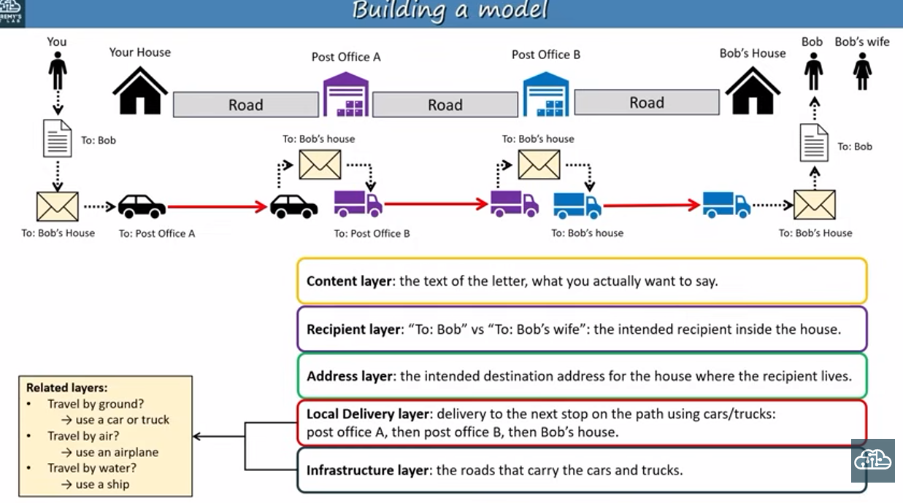

## Summary
The Internet Protocol Suite (commonly known as TCP/IP) is the universal family of rules that makes communication over the Internet and modern computer networks possible. Instead of treating networking as one single, massive process, TCP/IP divides communication into distinct, manageable layers. Each layer has a highly specialized responsibility and provides services to the layer directly above it while relying on the services of the layer directly below it. This modular architecture makes modern networks scalable and interoperable, allowing devices from completely different vendors to communicate seamlessly because they implement the same open standards.

---
## Key Concepts
### The Importance of Protocols and Standards
In network engineering, we rely on established rules to make communication possible. 
- **[[Protocol]]:** A set of rules that define how devices communicate over a network. Protocols are essentially the languages that computers use to talk. Computer using different protocols cannot exchange data.
- **[[Standard]]:** An agreed specification describing how a protocol or technology should work. When manufacturers follow these open, vendor-neutral standards, devices of all types can work together on the same network.
---
### A Brief History of TCP/IP
Understanding how the modern Internet came to be helps clarify why we use these specific rules today.
- **The Early Days (ARPANET):** Funded by the US Department of Defense, the ARPANET came online in 1969 to connect massive mainframe computers (powerful, centralized computers used by large organizations) at universities and laboratories. It originally used a rule set called the Network Control Program (NCP).
- **The Development of TCP:** In 1974, Vint Cerf and Bob Kahn began developing the Transmission Control Program. This program was later split into two separate protocols that we still use today: the Transmission Control Protocol (TCP) and the Internet Protocol (IP).
- **The Great Transition:** The ARPANET officially switched over to TCP/IP on January 1, 1983. Because TCP/IP was published as a set of open standards that any company could implement, and because it could run over many different types of networks, it quickly became the dominant global standard over competing vendor-owned options.
---
### Standards Organizations
Most network standards are created by independent organizations rather than a single manufacturer, allowing engineers from different companies to collaborate. Two of the most important groups are:
- **IEEE (Institute of Electrical and Electronics Engineers)** 
  - Defines physical transmission and local network technologies (physical cable types, wireless radio frequencies, and how signals are sent over physical mediums).
  - Known for: Standardizing Ethernet (IEEE 802.3) and Wi-Fi (IEEE 802.11)
  - Defines physical transmission and local network technologies.
- **IETF (Internet Engineering Task Force)** 
  - Defines core Internet protocols.
  - Publishes standards as **RFC (Request for Comments)** documents.
  - Examples:
    - IP
    - TCP
    - UDP
    - HTTP
    - DNS

---
### The Postal Mail Analogy
To understand how network layers work without getting lost in technical jargon, Jeremy uses the analogy of mailing a physical letter to a friend.

Imagine writing a letter addressed to your friend, Bob. You put the letter in an envelope, write his home address on the front, and drive it to your local post office. The post office loads your envelope into a truck and drives it to a sorting center, which then ships it to Bob's local post office. From there, a mail carrier delivers the envelope to Bob's house, where he opens it and reads your message.

This simple physical mail system maps beautifully to the five layers of the TCP/IP network model:

- **The Letter Content:** This represents the **Application Layer** (Layer 5), which is the actual data you want to convey.
- **The Recipient (To: Bob):** This represents the **Transport Layer** (Layer 4), which identifies exactly which person (or software process) inside the destination house should receive the message.
- **The House Address:** This represents the **Internet Layer** (Layer 3), which is the permanent, unique end-to-end destination of the building (or host computer).
- **The Vehicles (Cars, Trucks, or Planes):** This represents the **Local Network Layer** (Layer 2), which physically moves the envelope from one specific point (or hop) to the next along the journey.
- **The Roads and Flight Paths:** This represents the **Physical Layer** (Layer 1), which is the physical infrastructure that the vehicles travel on.

**Why this analogy matters:** Just like in the mail system, what happens inside one layer does not disrupt the others. If you change the contents of your letter, the postal carrier does not have to change their driving route. Similarly, if the post office upgrades their delivery trucks to airplanes, the content of your letter remains completely unaffected. This independence is the core benefit of a modular, layered network.

--- 
### TCP/IP Five-Layer Model
In this course, we use a five-layer model to map out how networks operate.

| Layer | Name                                                                   |
| ----- | ---------------------------------------------------------------------- |
| 5     | [[Application Layer\|Application Layer]]                               |
| 4     | [[Networking/knowledge-base/Transport Layer\|Transport Layer]]         |
| 3     | [[Networking/knowledge-base/Internet Layer\|Internet Layer]]           |
| 2     | [[Networking/knowledge-base/Local Network Layer\|Local Network Layer]] |
| 1     | [[Networking/knowledge-base/Physical Layer\|Physical Layer]]           |

---
### Layer Responsibilities

| Layer         | Responsible For                  | Uses                 |
| ------------- | -------------------------------- | -------------------- |
| Application   | Application communication        | HTTP, DNS, FTP       |
| Transport     | Process-to-process communication | TCP, UDP, Ports      |
| Internet      | Host-to-host communication       | IP, Routers          |
| Local Network | Hop-to-hop communication         | Ethernet, Wi-Fi, MAC |
| Physical      | Signal transmission              | Cables, Fiber, Radio |

---
### [[Networking/knowledge-base/Encapsulation|Encapsulation]]
To understand how a single message contains all of this layered information, we look at how data is packaged and unpackaged. 
#### Encapsulation (Sending Data)
As a message moves down the network stack on the sending device, each layer wraps the data in a **header** containing the address and control information needed for that layer.
1. **Application Data (Layer 5):** The software application prepares the raw message, like an HTTP web request. 
2. **Transport Header (Layer 4):** The Transport Layer wraps the application data with a header containing source and destination port numbers. 
3. **Internet Header (layer 3):** The internet layer wraps the transport segment with a header containing source and destination IP addresses.
4. **Local Network Header + Trailer (Layer 2):** The Local Network layer wraps the packet with a header containing local MAC addresses, and it also adds a **trailer** at the end. The receving device uses this trailer to run checks and detect if any transmission errors occured on the cable. 
5. **Physical Signals (Layer 1):** The physical layer takes the completed frame and transmits its bits as physical signals across the medium.
### [[Networking/knowledge-base/Decapsulation|Decapsulation]]
The receiving host processes the incoming stream of bits by reversing the encapsulation steps, moving up the network stack:
1. The Physical layer receives the raw bits and passes them up.
2. The Local Network layer reads the Layer 2 header and trailer to verify the local address and check for errors, then strips them off.
3. The Internet layer reads the Layer 3 header to verify the IP address, then strips it off.
4. The Transport layer reads the Layer 4 header to find the correct port number, then strips it off.
5. The raw application data is delivered directly to the target software process.

---
#### Hop-to-Hop vs End-to-end Communication
To successfully deliver data across different networks, the TCP/IP model separates local physical movement from long-distance logical delivery.
1. **Hop-to-Hop Communication**
	- **Defnition:** A hop is defined as one physical step along the path between two devices, moving from one router or host to the next.
	- **The Layer in Charge:** This is handled at **Layer 2 (Data Link/Local Network)**
	- **How it Works:** Layer 2 uses physical **MAC Addresses** (unique identifiers burned into a device's network card) to deliver the data frame to the next immediate device in the chain.
	- **The [[Networking/knowledge-base/Switch|Switch]] Exception:** Switches do not count as hops. A switch simply acts as an extension of the local network, allowing multiple local devices to connect to the same LAN.
	- **Example Path:** If a message travels from PC1 to Router 1, then to Router 2, and finally to Server 1, the journey takes exactly **three hops** (PC1 to R1 is hop one, R1 to R2 is hop two, R2 to Server 1 is hop three.)
2. **End-to-End Communication**
	- **Definition:** This refers to the entire communication journey from the original source host all the way to the final destination host, regardless of how many intermediate devices sit in the middle.
	- **The Layers in Charge:** This is handled at **Layer 3 (the Internet/Network Layer)** for host-to-host delivery, and **Layer 4 (the Transport Layer)** for process-to-process delivery.
	- **How it Works:**
		- **At Layer 3:** The Internet layer uses logical **IP Addresses** to identify the source and final destination hosts across multiple networks. Routers look at this layer 3 IP address to make forwarding decisions. 
		- **At Layer 4:** The Transport layer uses **port numbers** (software-based identifiers) to make sure the data reaches the correct application process (like a specific web browser tab or email client) once it arrives at the destination host.

---
#### Protocol Data Units (PDU) & Payloads

At each stage of the packaging process, the data bundle is referred to by a specific name.
-  **Segment:** The combination of application data and a Layer 4 header when using the TCP protocol.
- **Datagram:** The combination of application data and a Layer 4 header when using the UDP protocol.
- **Packet:** The combination of a Transport PDU and a Layer 3 Internet header. This is the most common general term used for network messages, but technically it refers specifically to Layer 3.
- **Frame:** The combination of an IP packet and a Layer 2 header and trailer. The frame is what is actually transmitted over physical media. You will never see a raw packet or segment traveling over a cable; they are always carried inside a frame.
---
#### How the Layers Interact
The cooperation within each devices and between devices is what makes network communication possible.
- **Adjacent-Layer Interaction:** This refers to how a layer on a single device provides services to the layer directly above it and relies on the services of the layer directly below it. For example, Layer 3 relies on Layer 2 to deliver its packets to the next physical hop.
- **Same-Layer Interaction:** This refers to how equivalent layers on different devices logically communicate with each other. For example, the Transport Layer on your computer sets port number specifically so the Transport layer on the destination server can interpret which application should receive the data.
---
### Comparative Tables & Study Charts
#### TCP/IP vs OSI Model
While we use the TCP/IP protocol stack to run real-world networks, we keep the 7-layer OSI (Open Systems Interconnection) reference model around as a conceptual reference and teaching tool.

|TCP/IP Model (5-Layer)|OSI Model (7-Layer)|Equivalent Functions & Differences|
|---|---|---|
|**Application (Layer 5)**|**Application (Layer 7)**   **Presentation (Layer 6)**   **Session (Layer 5)**|The TCP/IP Application layer combines the duties of formatting, session management, and application interaction into a single layer.|
|**Transport (Layer 4)**|**Transport (Layer 4)**|Identifies running applications using port numbers and manages end-to-end communication streams.|
|**Internet (Layer 3)**|**Network (Layer 3)**|Responsible for logical addressing (IP addresses) and routing data across different networks.|
|**Local Network (Layer 2)**|**Data Link (Layer 2)**|Handles local delivery of data (frames) using physical MAC addresses within a single local area network.|
|**Physical (Layer 1)**|**Physical (Layer 1)**|Handles the physical transmission of raw binary bits as electrical, optical, or radio signals over hardware.|
#### Why TCP/IP Defeated the OSI Model
During the late 1970s and 1980s, governments and committees heavily promoted the OSI model, expecting it to become the global standard. However, TCP/IP won the real-world battle because of its design philosophy:
- **OSI was too bureaucratic and top-down:** Committees spent years designing highly complex protocols in theory before any vendors actually built or tested them. By the time the standards were finalized, they were too complex to implement efficiently.
- **TCP/IP was practical and bottom-up:** It was designed and adjusted through real-world implementation on the ARPANET. Because it was published as a set of open, free standards that could run over almost any physical medium, vendors rapidly adopted it
---
#### Core Networking Address Hierarchy

|Addressing Type|Layer|Primary Device|Scope of Address|Purpose|
|---|---|---|---|---|
|**Port Number**|Transport (Layer 4)|Endpoint Hosts|Process-to-Process|Identifies the specific software service or application process on a device.|
|**IP Address**|Internet (Layer 3)|Routers|End-to-End|Identifies the unique host device across multiple networks.|
|**MAC Address**|Local Network (Layer 2)|Switches|Hop-to-Hop|Identifies the physical interface for local delivery on the same network segment.|

---
#### Study & Learning Strategies

**Jeremy's Big-Picture Advice**
Do not stress about memorizing every single protocol, port number, or historical date on your first pass through this material.
- Treat this 5-layer model as a filing cabinet with empty shelves.
- As you progress through the course and learn about specific routing protocols, switching mechanics, or TCP windowing, you will easily be able to slot those detailed concepts into these general shelves.
- Real-world protocols do not always fit perfectly into a single layer, and that is completely fine. The model is simply a conceptual tool to help you think about what is happening in the network.

**CCNA Exam Reality Check**
You do not need to worry about disputed layer names or numbering debates on the actual CCNA exam. In practice, network engineers almost exclusively refer to layers by their numbers (such as saying "Layer 2" or "Layer 3"). The exam focuses heavily on your understanding of encapsulation, decapsulation, PDU names, and the specific duties of each layer.

## References
- Jeremy's IT Lab: [How the TCP/IP Model Actually Works | CCNA Day 3](https://youtu.be/yM-XNq9ADlI?si=pC_pcz3AbsZqwqQx)